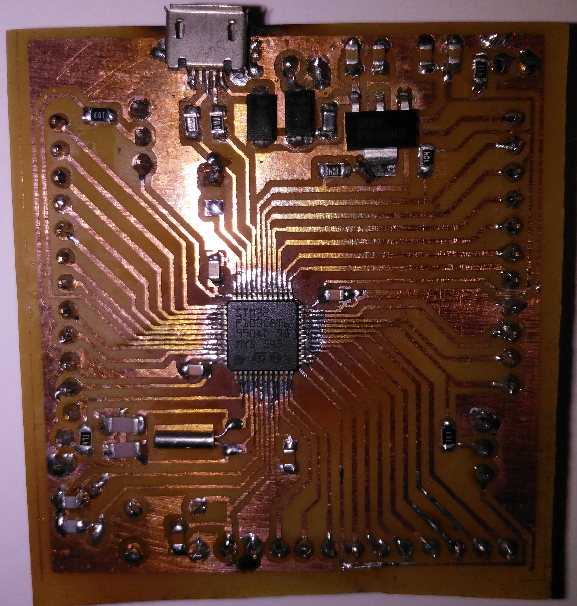
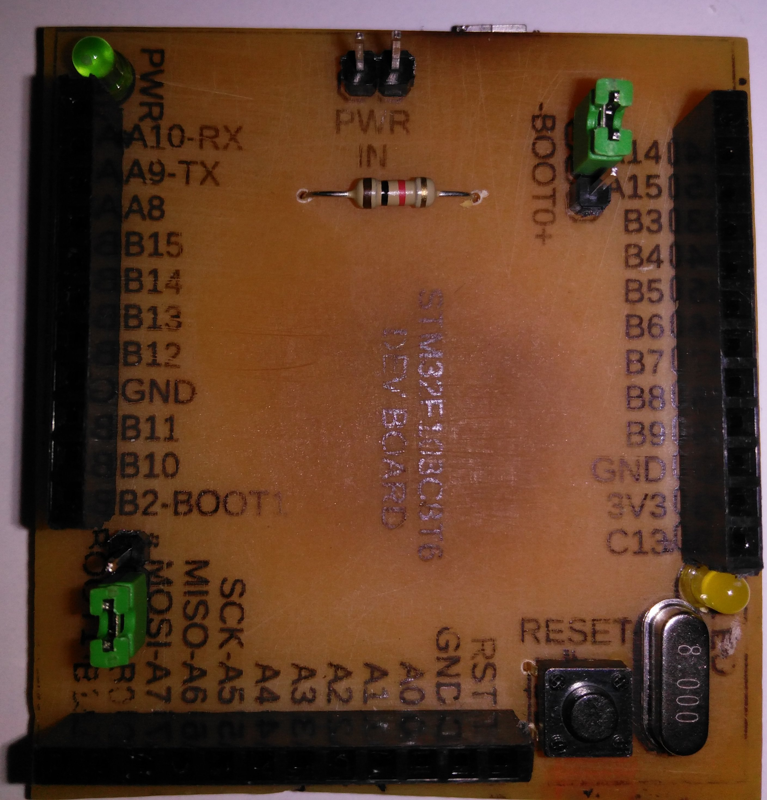
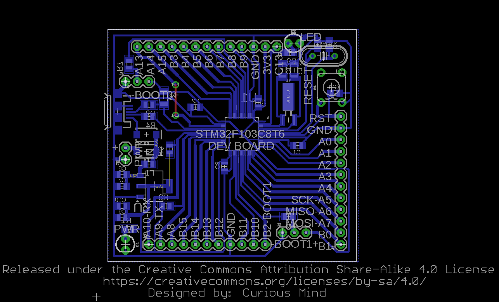
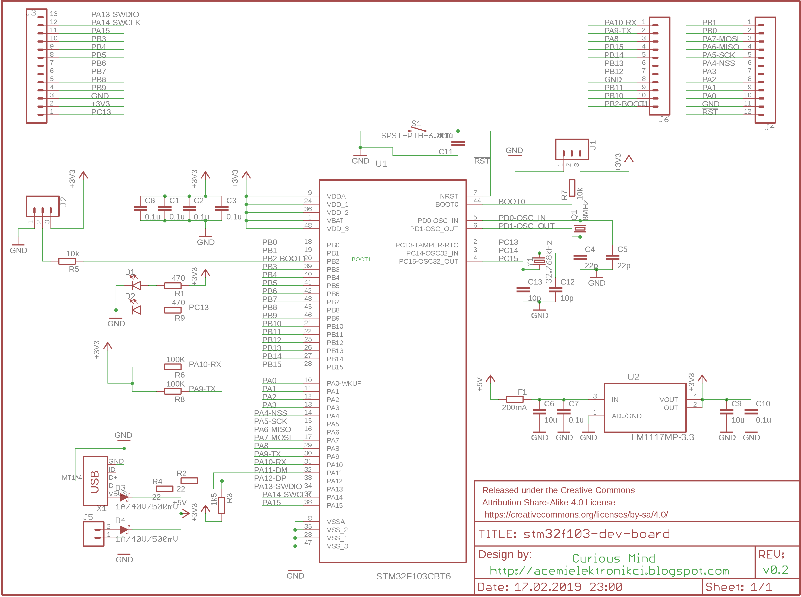

# STM32F103C8T6_DEV_BOARD

Single sided DIY PCB for STM32F103C8T6

There are many pcb designs for stm32f103C8T6 what makes this design special is:
- it's single sided
- minimum number of bridges at top side (only one bridge)
so it's very diy friendly (I think).

Here is photos of earlier version:
Bottom side</img>
Top side</img>

And here images of pcb and schematic
pcb</img>
schematic</img>

